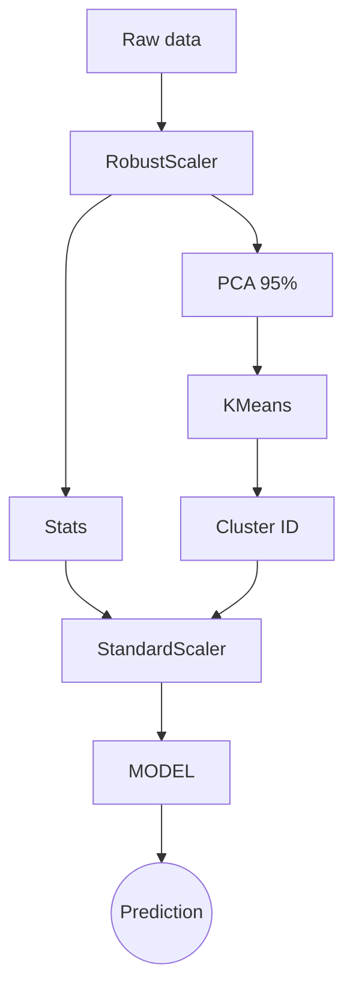

# SANTANDER CUSTOMER TRANSACTION PREDICTION

## 📖 Overview 

This repository contains a solution for the Santander Customer Transaction Prediction 
competition on Kaggle. More details about the competition can be found 
[here](https://www.kaggle.com/competitions/santander-customer-transaction-prediction/overview).


## 🎯 Objectives 

The goal of this competition is to identify which customers will make a specific transaction 
in the future, irrespective of the amount of money transacted. 


## 🧰 Tools and approach 

The techniques used to solve the problem include: 

- EDA on the dataset. 
- A pipeline for data preprocessing, feature engineering, and model training, consisting of 
  the following steps:
  - `RobustScaler` for the initial scaling process. 
  - `PCA` for dimensionality reduction, keeping the 95% of the variance explained. 
  - Feature engineering to create new features based on the existing ones. 
  - `KMeans` for clustering the data and adding more features. 
  - `StandardScaler` for the final scaling process, previous to the model training. 
  - `XGBoost` as the predictor model. 


## 📊 Results 

The model achieved an AUC score of 0.8754, Precision of 0.3901, Recall of 0.6736 and F1 
score of 0.4941, all these metric averaged over 5 folds. It also achieved a score of 0.77821 
on the public leaderboard of the competition. 


## 📁 Directory structure 

```bash 
├── 📁data
   ├── 📊test.csv 
   ├── 📊train.csv 
├── 📁models
   ├── 🐍__init__.py 
   ├── 🐍clustering.py
   ├── 🐍model.py 
├── 📁pipeline
   ├── 🐍__init__.py
   ├── 🐍pipeline.py
├── 📁preprocessing
   ├── 🐍__init__.py 
   ├── 🐍pca.py 
   ├── 🐍scaler.py 
   ├── 🐍stats.py
```

## 🧠 Solution Architecture 


The solution follows a modular pipeline design with the following structure:

1. **Preprocessing**:
   - `RobustScaler` is applied to reduce the effect of outliers.
   - `PCA` reduces dimensionality while keeping 95% of the variance.
   - `KMeans` clustering adds extra features based on data segmentation.
   - `StandardScaler` is used before feeding the model.

2. **Modeling**:
   - An `XGBoost` model is trained using a wrapper class for easy integration.
   - `StratifiedKFold` cross-validation ensures class balance in all folds.


